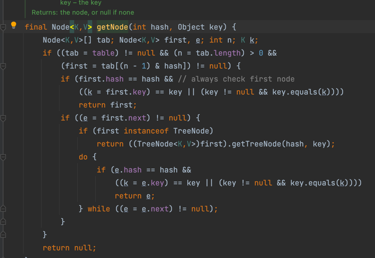

##HashMap
* 基本概念
  ``hashMap数据结构为数组加链表，链表至少8且数组length大于64时会变为红黑树，否则扩容``
  
  ``链表至少8时会转为红黑树，小于6时会变会链表``
  
* rehash逻辑
``tab扩容两倍，hash(key)/(newCapacity-1),jdk7采用头插入(多线程下会产生环)，jdk8采用尾插入``
````
  
* hashmap.get

  
* resize
``数据量大于threshold时会触发resize``

* put
``jdk7采用分段锁，jdk8采用cas加synized 提高了并发度，缩小了锁的范围``
  
  ``Segment对象继承了ReentrantLock``
  