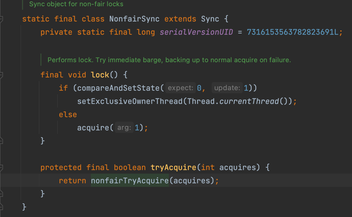
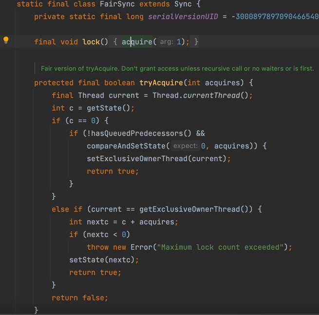
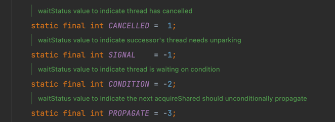
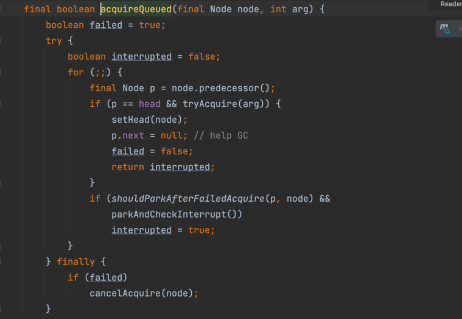
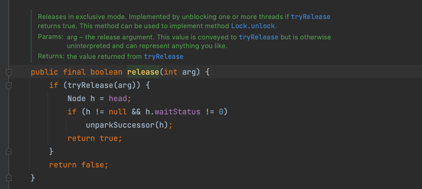
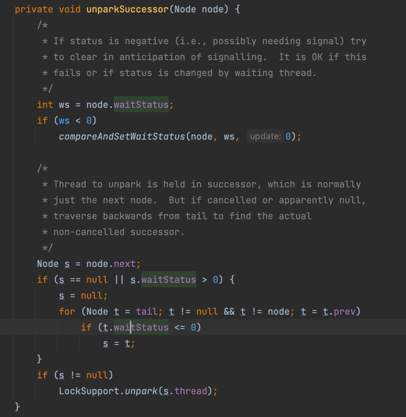

####ReentrantLock解析
1. 公平锁和非公平锁的解析
`` 公平锁和非公平锁，解锁是都是按照队列一个一个有序获取锁unparkSuccessor
   区别在于，新来的线程是否需要判断等待队列hasQueuedPredecessors()``
 
   
2. reentrantLock中waitStatu
   
3. 线程获取锁失败在队列中等待唤醒的逻辑
``如果是 reentrantLock.tryLock(1, TimeUnit.DAYS)，会尝试2次获取锁，失败后把线程状态改为signal，再获取一次锁如果还是失败等到超时后再获取一次锁``

   
4.释放锁的逻辑
``尝试释放锁（减state，state减到0，释放排他锁``

``从head的下一个节点开始唤醒，若果下一个节点null或者下个节点的线程被取消了，则反向遍及最后一个没有被cancelled节点进行唤醒``

