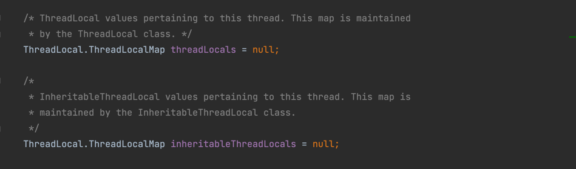
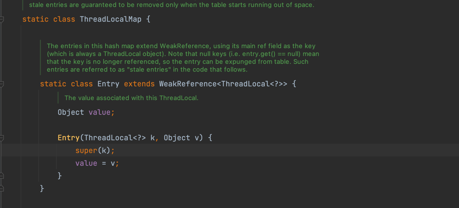
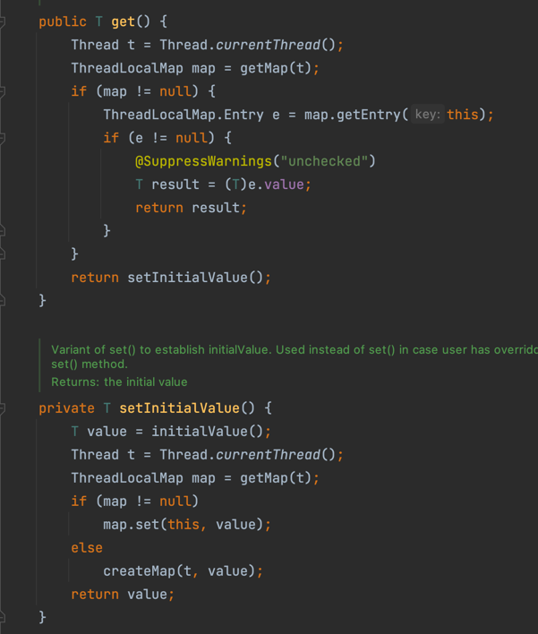
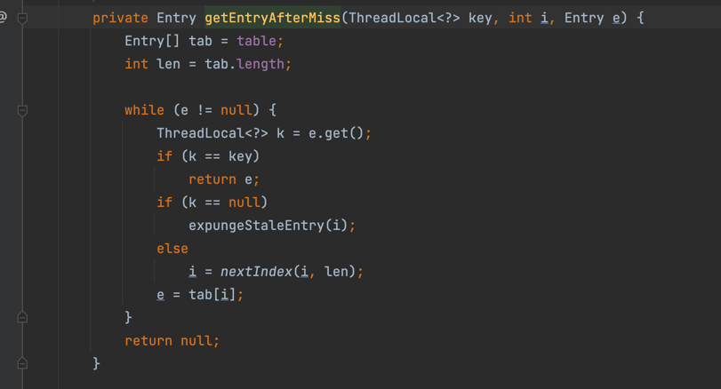

java.lang.ThreadLocal提供了thread-local变量
空间换时间
关联类
* Thread
  ``线程类里有两个map用来绑定threadlocal``
  ````
* ThreadLocalMap
  ``threaLocalmap中的entty是继承了WeakReference在key清空，下一次gc时将被回收。map的key时threadLocal对象。
  ``
  
* WeakReference
## 初始化时机（lazy init)

##主要方法
* get方法
``通过自增的threadLocalHashCode和table的size计算除entry的位置，比较key，如果不等，循环比较下一个位置``
