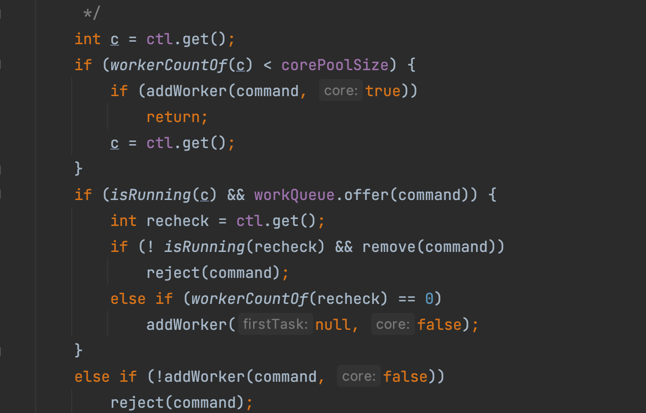
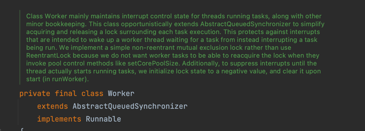
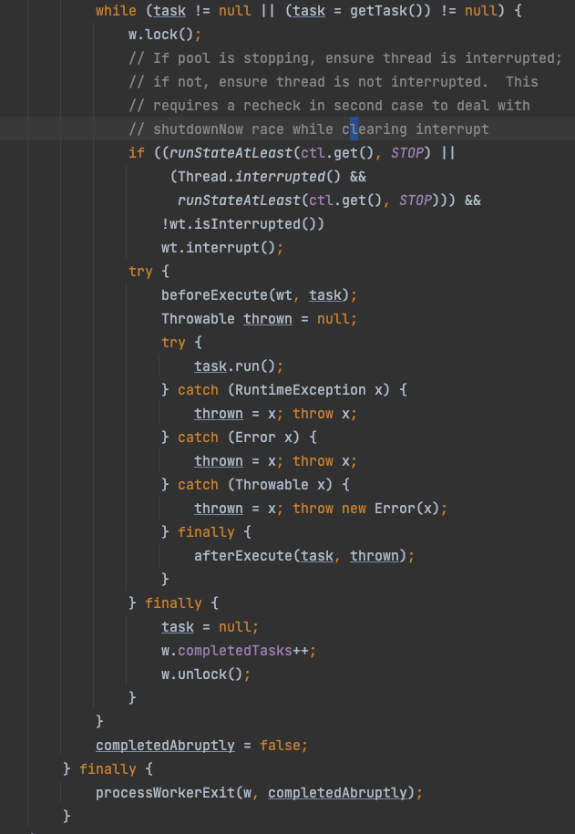
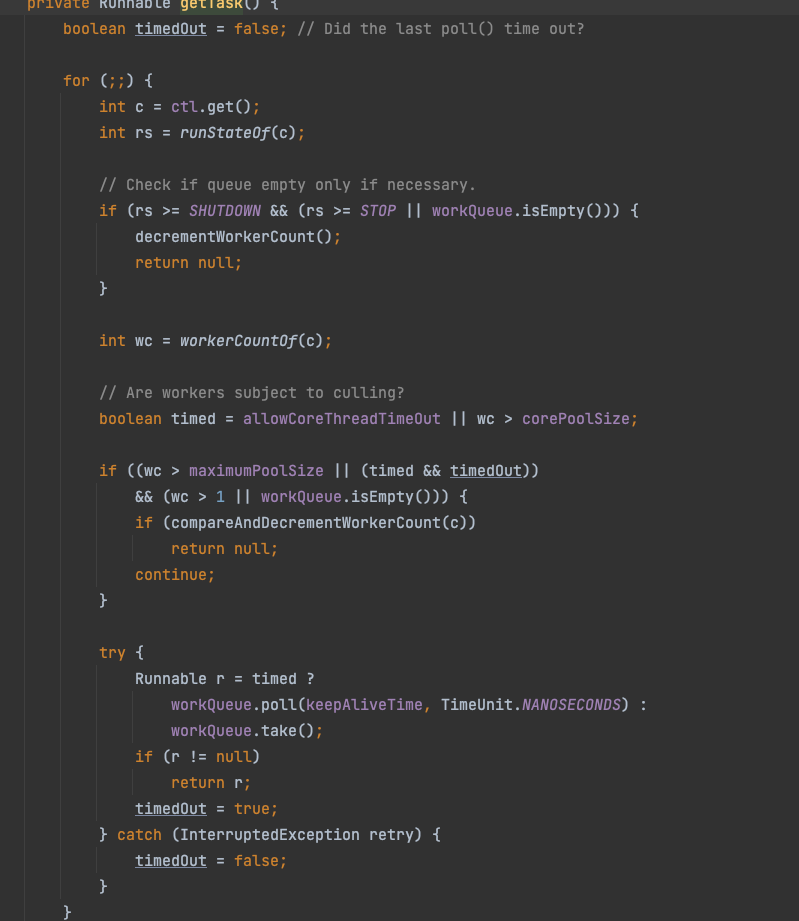

####ThreadPoolExecutor解析
1. execute执行逻辑
``核心线程未满是添加核心线程，核心线程已经满了，加入队列，队列慢了加入非核心线程，操作失败执行拒绝策略``

   
2.work类继承抽象队列同步器，和runnable

3.runWork()
``循环用getTask获取任务执行，获取不到任务时，跳出循环``

4.getTask()
``循环获取任务，timed使用poll，非timed使用take``

